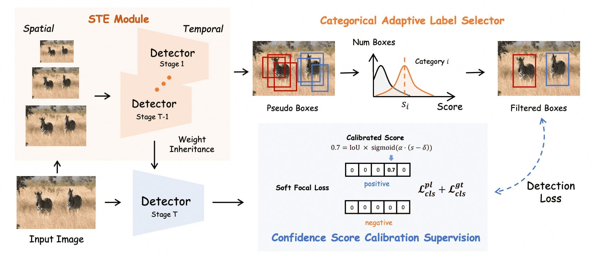

# PseDet:Revisiting the Power of Pseudo Label in Incremental Object Detection

[ICLR 2025] Revisiting the Power of Pseudo Label in Incremental Object Detection

<div align="center">
<p align="center">
  
</p>
</div>

## 🚀 Overview

- We revisit the strategy of pseudo-labeling on incremental object detection and identify three critical problems that hinder it from achieving competitive performance.
- Based on the above findings, we propose PseDet, a simple yet effective pseudo-labeling framework for incremental object detection, which consists of three key components: spatiotemporal enhancement module, categorical adaptive label selector, and confidence score calibration supervision. 
- Extensive experiments conducted on the MS COCO dataset with various incremental settings validate the effectiveness and generalization of our approach. Notably, PseDet outperforms previous methods by 4~17 mAP on different learning settings, achieving new state-of-the-art in incremental object detection.

## 🛠️ Requirements

Before you begin, ensure you have the following prerequisites installed on your system:

- Python (3.6+)
- PyTorch (1.3+)
- CUDA (9.2+)
- [MMDetection](https://github.com/open-mmlab/mmdetection).

## 💻 QuickStart

### Two Stage Scenarios

> **1.Train the initial model using the provided script:**

```bash
./tools/dist_train.sh ./coco_cfg/train_stage_init/gfl_r50_1x_s0_40cls.py $nums_gpu
```

> **2.Infer Pseudo-Labels**

Generate pseudo-labels for the first stage:

```bash
./tools/dist_test.sh ./coco_cfg/generate_pseudo/gfl_infer_classes_40.py $checkpoint_path $nums_gpu --tta
```

> **3.Second Stage (40+40 cls)**

Train the model on the second stage with pseudo-labels:

```bash
./tools/dist_test.sh ./coco_cfg/train_stage_40_40/gfl_r50_1x_44_s1_80cls.py $nums_gpu
```

### Multi Stage Scenarios

> **1.Train the initial model (40 cls) and Infer Pseudo-Labels**

```bash
./tools/dist_train.sh ./coco_cfg/train_stage_init/gfl_r50_1x_s0_40cls.py $nums_gpu
./tools/dist_test.sh ./coco_cfg/generate_pseudo/gfl_infer_classes_40.py $checkpoint_path $nums_gpu --tta
```

> **2.Train Second Stage (40+20 cls) and Infer Pseudo-Labels**

```bash
./tools/dist_test.sh ./coco_cfg/train_stage_40_20_20/gfl_r50_1x_422_s1_60cls.py $nums_gpu
./tools/dist_test.sh ./coco_cfg/generate_pseudo/gfl_infer_classes_40.py $checkpoint_path $nums_gpu --tta
```

> **3.Train Third Stage (40+20+20 cls)**
```bash
./tools/dist_test.sh ./coco_cfg/train_stage_40_20_20/gfl_r50_1x_422_s2_80cls.py $nums_gpu
```

## ⚙️ Key Modules

### 1. Dataset Loader
Multi-stage COCO dataloader, which is capable of loading learning data from different stages during various phases of training.
```python
dataset=dict(
    type='CocoDatasetCLMultiStage,
    data_root=data_root,
    ann_file='annotations/instances_train2017.json',
    pseudo_file=pseudo_file, ## load pseudo labels, None for initial stage
    temporal=temporal, ## perform temporal enhancement
    data_prefix=dict(img='train2017/'),
    filter_cfg=dict(filter_empty_gt=True, min_size=32,
            classes_groups=classes_groups, ## [40,40] for two stage, [40,20,20] for multi stage
            class_spilt=True, ## True for continual learning
            stage_index = stage_index),
    pipeline=train_pipeline,
    backend_args=backend_args)
```

### 2.Evaluator
An evaluator designed for continual object detection, suitable for separate evaluation across different learning steps.
```python
dict(
  type='CocoMetricCLMultiStage',
  class_group=classes_groups, ## [40,40] for two stage, [40,20,20] for multi stage
  ...
)
```

### 3. Weight Initializer
In 40-40 setting, the number of classes for the head in the first stage is 40, and in the second stage, it's 80. 

A special hook is needed to load the weights: for the first 40 classes, we load the weights, while for the parameters of latter 40 classes, we initialize them.

```python
custom_hooks = [
    dict(type='CLLoadCheckpoint')
]
```

### 4. Detector
Detector for confidence score calibration supervision.
```python
bbox_head=dict(
  type='GFLHeadPseudoDynamic',
  num_classes=num_classes, ## Head CLASSES
  score_type = 'multiply', ## default: 'multiply'
  proj_score = True ## True for confidence score calibration
  ...
)
```

### 5. Spatio-Temporal Enhancement Module
Ehance quality of pseudo labels by spatio sampling and temporal combination during inference.
```python
dict(
type='DetTTAModelScalesKmeans',
tta_cfg=dict(nms=dict(type='nms',iou_threshold=0.4),
              max_per_img=100,
              kmeans=True,
              buffer_size=(num_classes,buffer_size)))
```


## 🙏 Acknowledgment
This work is implemented based on mmdet. We greatly appreciate their valuable contributions to the community.

## 📖 Citation
```
@inproceedings{wangpsedet,
  title={PseDet: Revisiting the Power of Pseudo Label in Incremental Object Detection},
  author={Wang, Qiuchen and Chen, Zehui and Yang, Chenhongyi and Liu, Jiaming and Li, Zhenyu and Zhao, Feng},
  booktitle={The Thirteenth International Conference on Learning Representations}
}
```